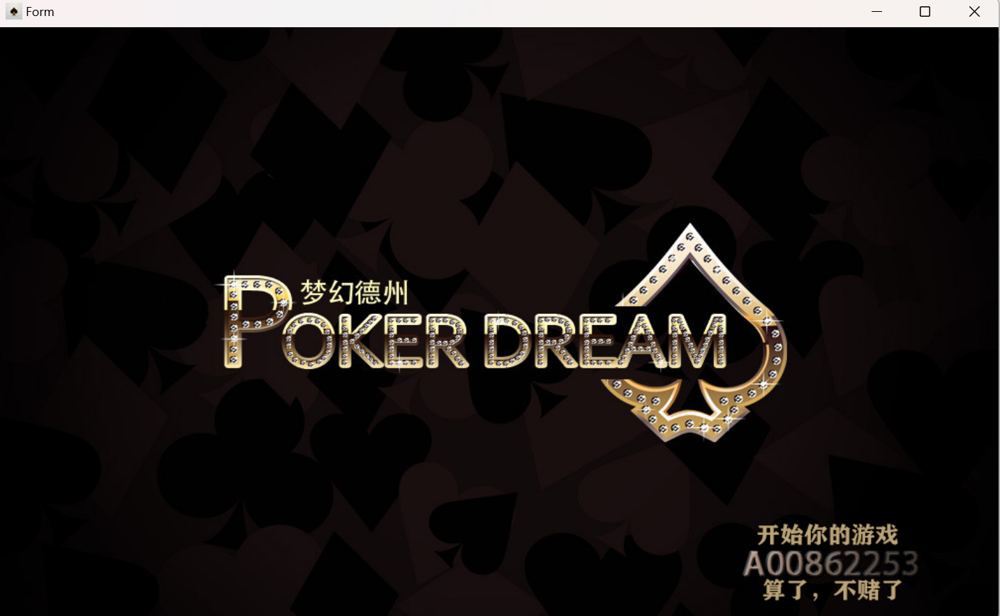
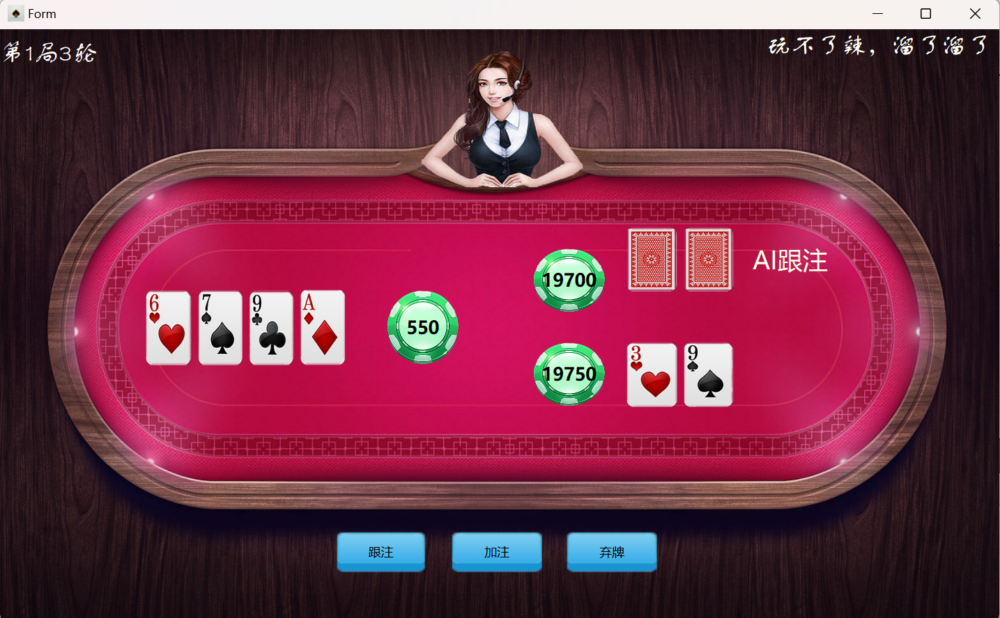
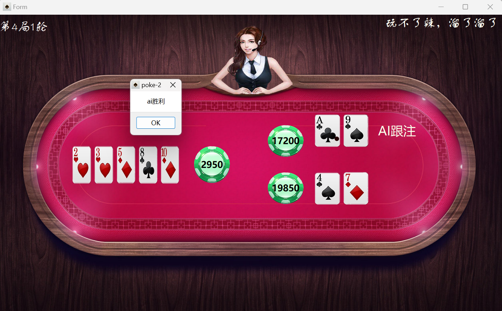

基于c++17和qt6开发的德州扑克游戏

本项目实现二人制德扑，人机1v1

游戏运行规则请见 `docs/rule.doc`

# 图片展示

# 使用
通过QT Creater打开项目`pro`文件，编译运行即可

或者下载编译好的`release`文件

# 架构
此程序采用原生的c++实现后端,QT实现前端,思想上类似于现代的WEB前端后分离项目

但代码没有完全分离（90%分离）

代码注释相对完善，尽量遵循见名知意的原则，我相信“优秀的代码本身就是一段注释”

### 后端架构
后端包含了下面几个类文件：

`banker game player poker pokerHeap table`

具体定义见对应头文件注释

### 前端架构

# 贡献
程序架构+后端实现：[codecreater](https://github.com/2507544221)

UI以及QT相关：[shenxi11](https://github.com/shenxi11)

# 声明
本程序由两个普通的大二学生完成，完成后开源供新手互相学习，水平有限

你可以随意使用本仓库的代码，但由此造成的任何法律责任与我们无关，详情见MIT License